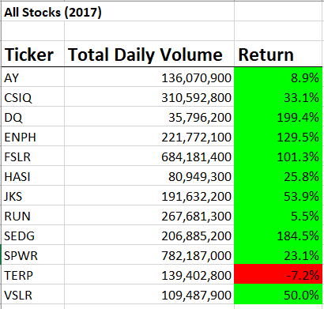
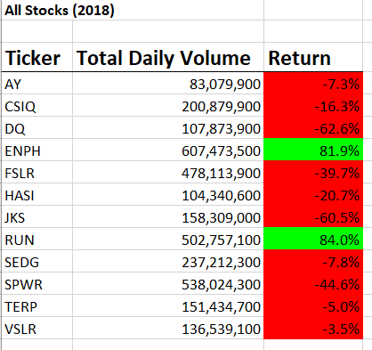
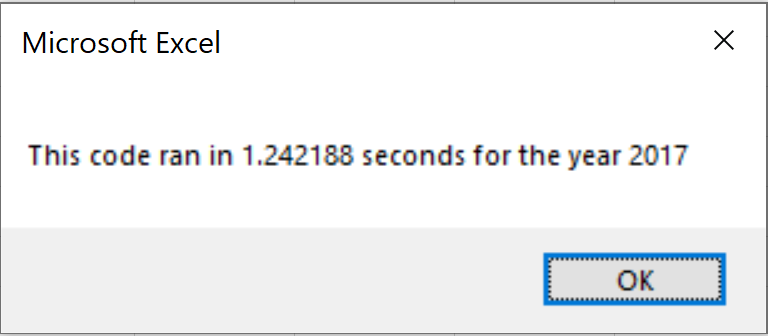
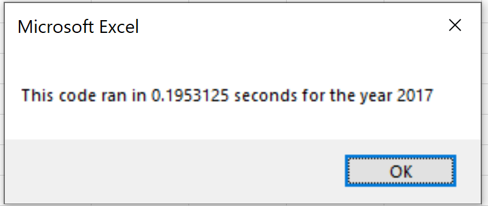
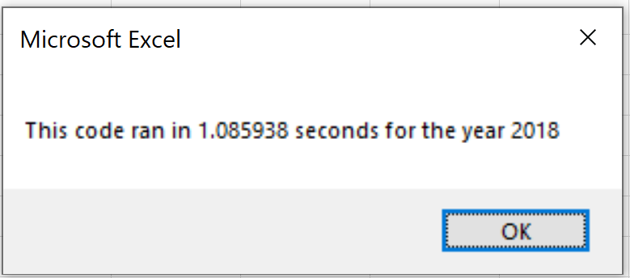

This analysis was created with the purpose of refactoring the Microsoft Excel VBA code while obtaining better efficiency on the code's runtime. We obtain 12 different stock data over the years from 2017 and 2018. With this data, we want to determine which stocks would be advisable to invest in based on the stock's history. The daily stock data for each stock contains the following information:

Stock Opening price
Stock Closing price
Stock High Price
Stock Low Price
Stock Closing Price
Stock Adjusted Closing Price
Volume of the Stock
Arrays provide you with random access to elements, which allows you to access position elements more efficiently compared to data structures. For the refactored code I created 4 arrays which are called:

tickers(12) = This array intends to create a ticker symbol that will be used to identify each stock
tickerVolume(12) = This array intends to hold volume data
tickerStartingPrice(12) = This array intends to hold the starting price
tickerEndingPrice(12) = This array intends to hold the ending price
Our Data Results:
Looking solely at the 2017 results, it would be very misleading for a potential investor because 11 of the 12 stocks that we are analyzing are showing a positive return, and some stocks with close to a 200% increase. However, one year later in 2018 only 2 out of the 12 stocks were showing a positive return. Based on a two-year trend we can see that the following stocks return a positive return in both years. :

ENPH
RUN
2017 Stock Analysis:

2018 Stock Analysis:

The initial runtime for my 2017 code took approximately 1.2422 seconds, however by refactoring I was able to bring the runtime down to approximately 0.1953 seconds.

Initial 2017 Runtime:

Refactored 2017 Runtime:

The initial runtime for my 2018 code took approximately 1.0896 seconds, however by refactoring I was able to bring the runtime down to approximately 0.1797 seconds.

Initial 2018 Runtime:

The advantage of refactoring the code is that when working with larger sums of data this could be an even more significant delay which in turn means a loss of profit for large companies. Every company strives to become more efficient regardless of the job type and the same applies with coding. One of the worst outcomes of refactoring would be to edit the original code and forgetting to save it prior to altering it. It is always best practice to save any code you work with along the way. You don't want to make your life harder by making a mistake while refactoring and also have the original code not work as well which could lead to huge financial losses from a company standpoint.

